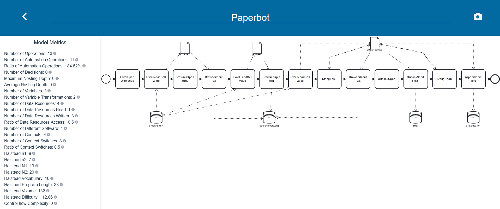

_This is the readme for the metrics component. [See here for main readme of the OntoRPA platform.](https://github.com/bptlab/onto-rpa-platform)_

# Complexity Metrics for RPA Bot Models
The metrics component is implemented as a part of the [OntoRPA front end](https://github.com/bptlab/onto-rpa-frontend/).

It allows measuring various complexity metrics for models concerning operations, control flow, data flow and data resources.
Furthermore, the component computes the adapted Halstead-based Process Complexity metrics and the control-flow complexity.

## Current Limitations

- The metrics implemented so far are not control-flow sensitive and thus might produce inacurrate numbers for models with decision logic.
- The user interface and presentation of the metrics need improvement.
- Some numbers are mistakenly inidicated to be rounded values.
